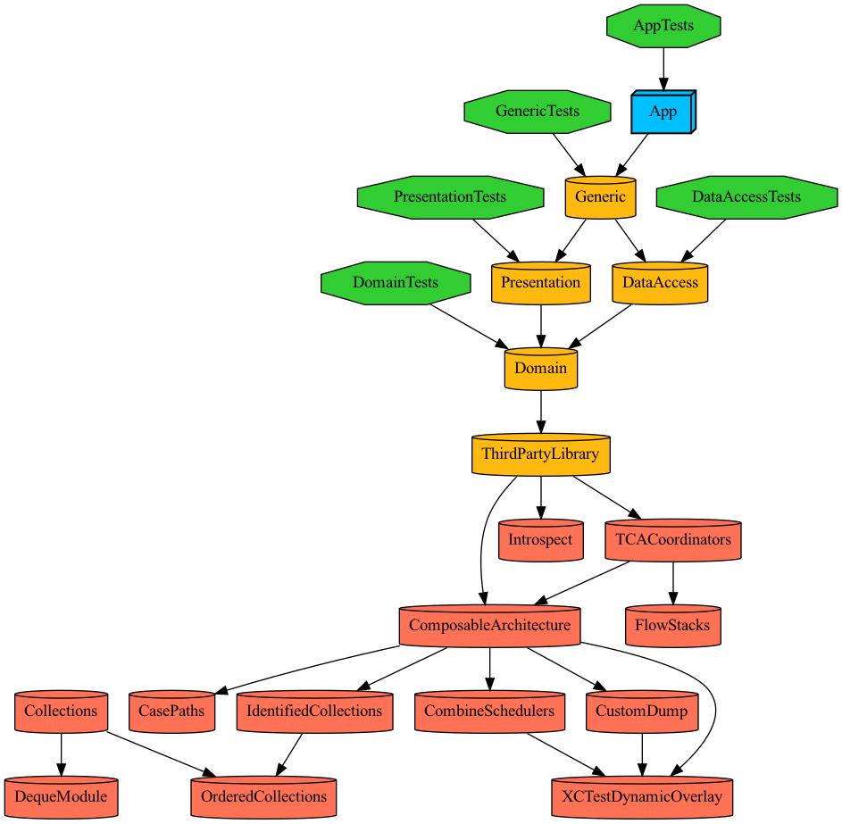
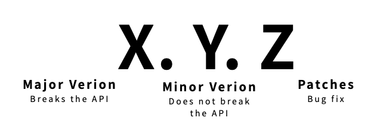

[](https://tuist.io)
[](https://github.com/pointfreeco/swift-composable-architecture) 

### Bootstraping
```
$ bin/bootstrap.sh
```

### Dependencies


### Versioning 


앱의 버전은 [Semantic Versioning](https://semver.org/)을 기반으로 합니다.

1. 기존 버전과 호환되지 않도록 API가 변경되면 Major버전을 올립니다.
2. 기존 버전과 호환되면서 새로운 기능을 추가할 때는 Minor버전을 올립니다.
3. 기존 버전과 호환되면서 버그를 수정한 것이라면 Patches버전을 올립니다.

## Event storming
[Miro](https://miro.com/welcomeonboard/enFDaXZOQ3FVMzRCQmE5QVppNVQ0Z0hDMElsUnZpbmZsSFh3RllwNFU2WWN0RTN2RFJ2SEhYc0NLeWNRWFpheXwzNDU4NzY0NTI5MzU0NDE2MjQ4?share_link_id=935746445276)
